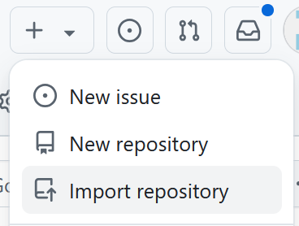
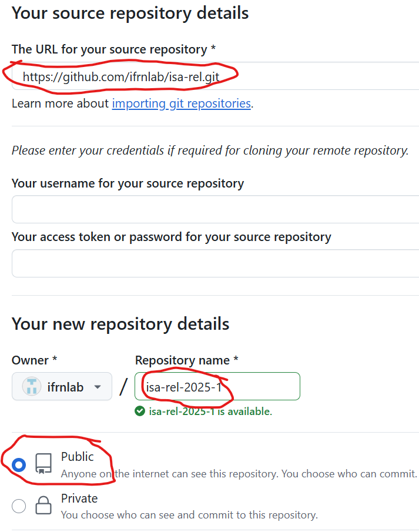

# isa-rel
Relatório de ISA

## Material

 - [ ] Conta no [GitHub](https://github.com/)
 - [ ] Máquina virtual (VM) ...

## Roteiro

1. Acesse o GitHub
2. Importe o repositório `isa-rel`

   Veja a imagem:
   
   
   
3. Escolha o repositório de origem

   Veja a imagem:

   

   1. URL: `https://github.com/ifrnlab/isa-rel.git`
   2. Nome: `isa-rel-2025-1`  
   3. Visibilidade: Pública
  
  
